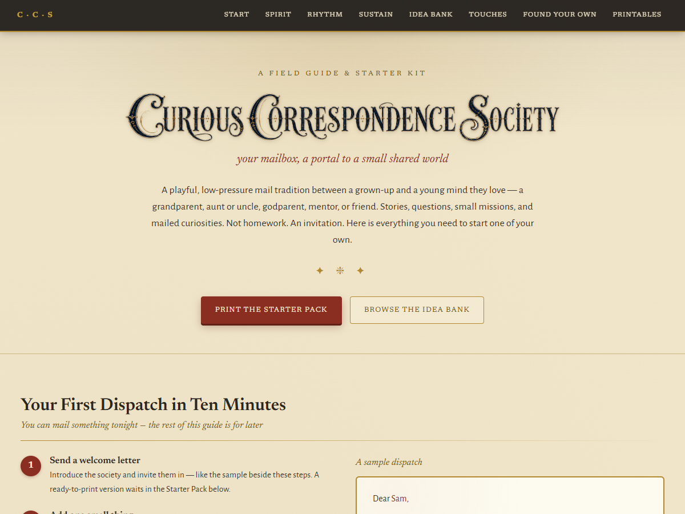

# The Curious Correspondence Society — Starter Kit

A field guide and printable starter kit for starting a playful mail tradition between a grown-up and a young mind they love. Commercial mystery-mail kits sell you their content, and printable shops sell blank templates; this kit hands over the whole tradition, free.

**[Open the field guide](https://caldwellcourtneyc.github.io/curious-correspondence-society/)** — read it, print the starter pack, and mail your first dispatch tonight.

## What's inside

- **First dispatch in ten minutes** — the fastest path from reading this to something in the mailbox
- **The spirit of the thing** — what makes it work (low pressure, real curiosity, no homework)
- **A rhythm menu** — sustainable cadences, and permission for the tradition to go quiet without failing
- **An idea bank** — dozens of dispatch ideas: missions, ciphers, specimen requests, vocabulary treasure hunts
- **Printables** — welcome letter, membership cards, and starter-pack pages, with print CSS that outputs just the four pages you need

## Run it yourself

It's one HTML page with no build step and no JavaScript required. Clone the repo and open `index.html`, or just use the live page. Printing from the browser gives you the starter pack.

Everything bends to fit your own child, your own distance, your own pace. The guide is the tradition; the printables are just the on-ramp.

## License

[MIT](LICENSE)
